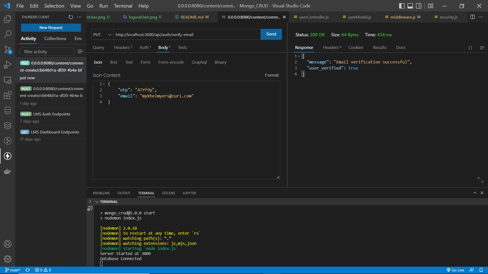

# Todo CRUD API with MongoDB

## Description

A Todo CRUD API that allows a user to create, get, update and delete a todo list.

With authentication and authorization implemented, users can register, verify email, login, recover password and set user roles.

Some user and todo routes such as `setRoles`, `createTodo`, `updateTodo`, and `deleteTodo` are admin protected, while `getAllTodo` and 
`getTodoByID` are auth protected.

## Technologies

* NodeJS
* Express
* MongoDB (Service used: Atlas cloud cluster)
* Mongoose
* Nodemailer

## Screenshots

### Register User

### Verify User using OTP

### Login User

### Logout User

### Password Recovery Mail

### Admin Protected Routes

### Auth Protected Route

